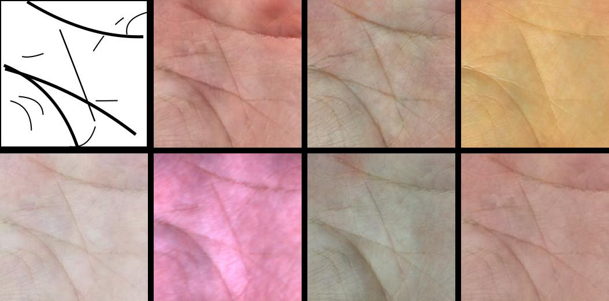
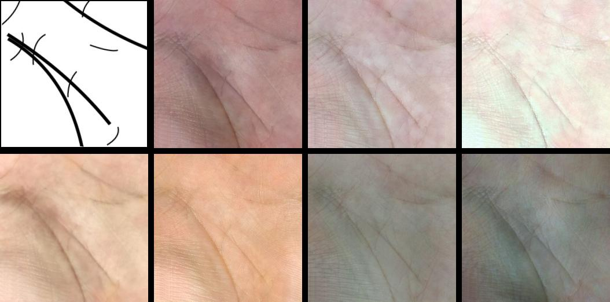
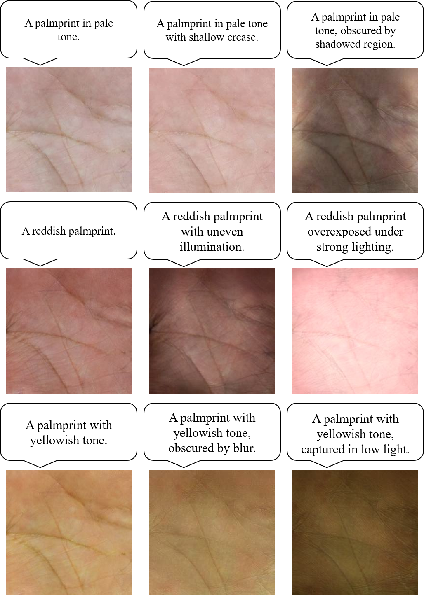

# Pytorch-PFIG-Palm

The PyTorch implementation of PFIG-Palm: Controllable Palmprint Generation via Pixel and Feature Identity Guidance

## Prerequisites

Code is intended to work with ```Python 3.8.x```, it hasn't been tested with previous versions

### [PyTorch & torchvision](http://pytorch.org/)

Follow the instructions in [pytorch.org](http://pytorch.org) for your current setup

### [Visdom](https://github.com/facebookresearch/visdom)

To plot loss graphs and draw images in a web browser view

```bash
pip3 install visdom
```

## Training

### 1. Setup the dataset

You can build your own dataset by setting up the following directory structure:

```
.
├── data
|   ├── train              # Training
|   |   ├── line           # Contains domain A images 
|   |   └── palm           # Contains domain B images 
|   └── val                # Testing
|   |   └── line           # Contains domain A images 
```

where lines can be synthesized by BezierCurve/synthesize2d.py:

```bash
python BezierCurve/synthesize2d.py --num_ids 10 --sample 2
```

### 2. Train!

To start training the PFIG-Palm model, use the following command:

```bash
python train.py --dataroot data/train --save_dir output/train --cuda
```

This command will start a training session using the images under the data/train directory. By default, the model is trained with the hyperparameters optimized for the PFIG-Palm architecture. You can modify these hyperparameters as needed. Both generators and discriminators weights will be saved under the output directory.

You can also view the training progress as well as live output images by running ```python3 -m visdom.server``` in another terminal and opening [http://localhost:8097/](http://localhost:8097/) in your web browser.

## Testing

To generate palmprint images using a pre-trained model, run the following command:

```bash
python test.py --dataroot data/val --output_dir output/val --n_images 40 --cuda
```

This command will process the images in the dataroot directory, generate palmprint images using the pre-trained generator, and save the output in the specified output_dir. You can tweak parameters such as the number of images to generate, the path to the generator weights, and more.

Examples of generated outputs (default parameters):


 

## Text-Prompt-control Generation

We provide a demo script **`test_text_control_demo.py`** for generating palmprints from line images using text prompts (CLIP-guided).

```bash
python test_text_control_demo.py
```

Examples of text prompt outputs:



## Pre-trained Models and Generated Samples

We provide pre-trained model weights and generated samples (2000 IDs with 40 images per ID) on Google Drive:

**[Download Link](https://drive.google.com/drive/folders/1qyOJjNbFrh_TcaNWWVCIQhZkRq3NfFyf)**

The folder contains:
- Pre-trained generator and discriminator weights
- Generated palmprint samples: 2000 identities × 40 images each

## Citation

If you use this code or our pre-trained models in your research, please cite our paper:

```bibtex
@article{zou2025pfig,
    title        = {PFIG-Palm: Controllable Palmprint Generation via Pixel and Feature Identity Guidance},
    author       = {Zou, Yuchen and Shao, Huikai and Liu, Chengcheng and Zhu, Siyu and Hou, Zongqing and Zhong, Dexing},
    year         = 2025,
    journal      = {IEEE Trans. Image Process.},
    volume       = 34,
    pages        = {6603--6615}
}
```

## Acknowledgments

[Add any acknowledgments here]
